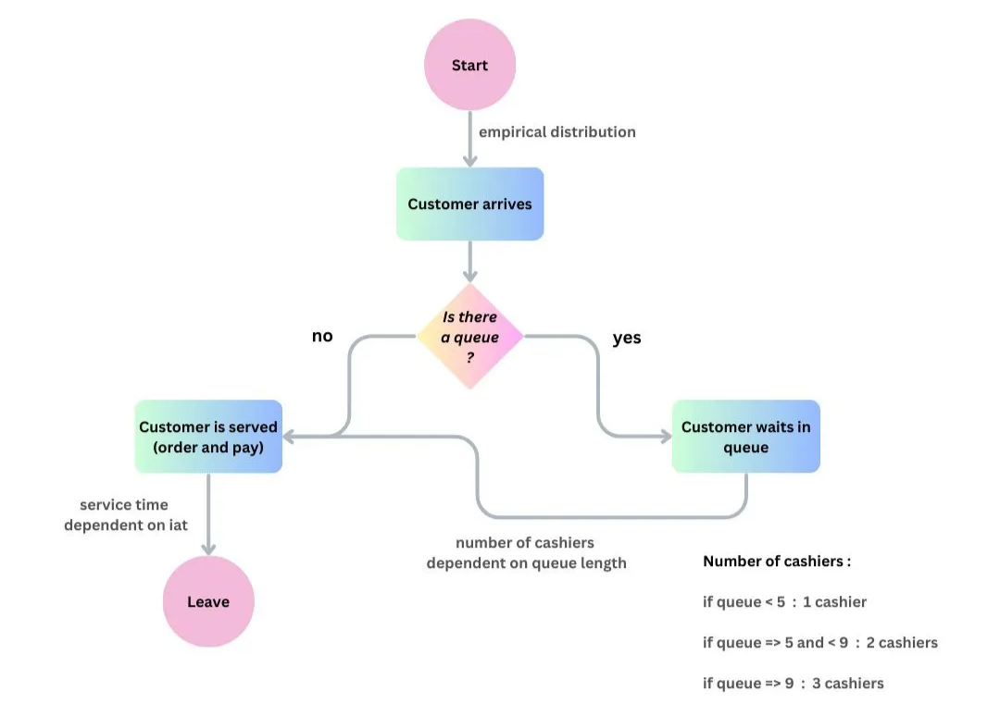

# Simulation-Project

## **Project Overview**

This university project explores the optimization of an ice cream shop’s operations using simulation and data analysis techniques. The goal was to identify the optimal configuration of the shop that minimizes customer waiting times, reduces queue length, and maximizes the number of customers served to ultimately increase revenue.

The central question of the study was:

> What is the best configuration of the ice cream shop to reduce waiting time, shorten queues, and maximize customer throughput?
> 

High waiting times and long queues can deter potential customers, reducing sales and revenue. By strategically analyzing customer arrival patterns and service times, the study aims to improve operational efficiency and enhance customer satisfaction.

## **Approach & Methodology**

1. **Data Collection:** Customer arrival times and service durations were tracked to model realistic shop dynamics.
2. **Simulation Modeling:** Using Python and the `simpy` library, a simulation of the ice cream shop operations was created to test different configurations and scenarios.
3. **Analysis:** Statistical analysis and visualization techniques (`pandas`, `numpy`, `matplotlib`, `seaborn`) were applied to identify patterns and evaluate the effectiveness of each configuration.
4. **Optimization:** Different combinations of staffing and service strategies were simulated to find the configuration that maximizes throughput while minimizing wait times.

## **Key Insights & Results**

- Reducing service bottlenecks significantly decreased average waiting times.
- Optimal staffing and service configurations increased the total number of customers served daily.
- Simulation allowed for testing multiple operational scenarios without real-world disruption, providing actionable recommendations for shop management.

## **Technologies & Tools Used**

- **Python:** `simpy`, `pandas`, `numpy`, `matplotlib`, `seaborn`
- **Statistical Analysis:** `scipy`, `statsmodels`
- **Simulation Modeling:** Discrete-event simulation to mimic customer flow and service dynamics

## **Impact**

This project demonstrates the practical application of simulation and data analysis in operational optimization. By translating data into actionable insights, the study provides a roadmap for improving customer experience and revenue performance in service-oriented businesses.
